# 基于node+vue的 购物网站 购物商城 

## 一、介绍
 基于node+vue的购物商城 购物网站，分为两个角色，管理员和用户，可以拓展为水果商城，农产品商城，服装商城网站等等
 1. 用户：购买商品，领取优惠券，查看订单，添加收货地址，商品评价等等
 2. 管理员：用户管理，商品管理，订单管理等等
 3. 温馨提示：这个代码不完整，如有需要可咨询我们

## 二、技术栈
1.  前端：vue框架
2.  后端：nodejs express框架
3.  数据库：mysql

## 三、效果展示图
### 1.用户端
##### 首页
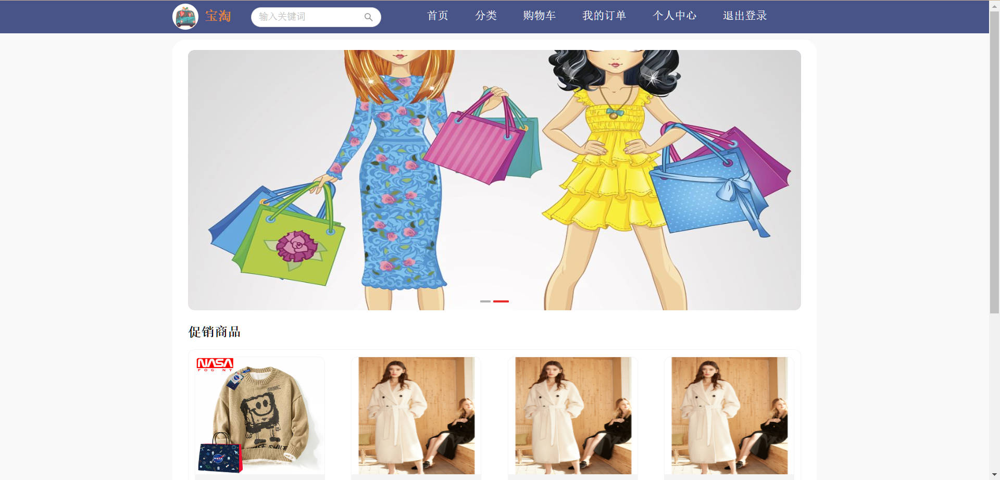
##### 商品分类
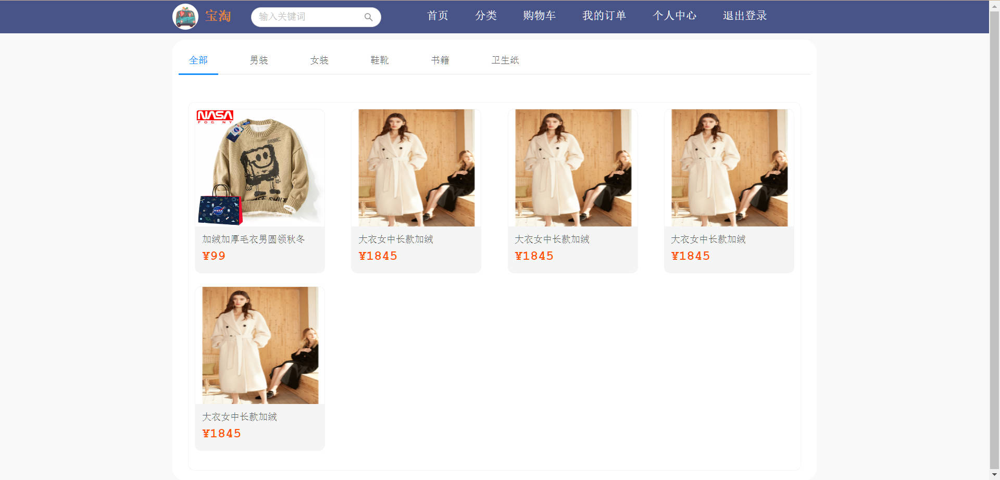
##### 购物车
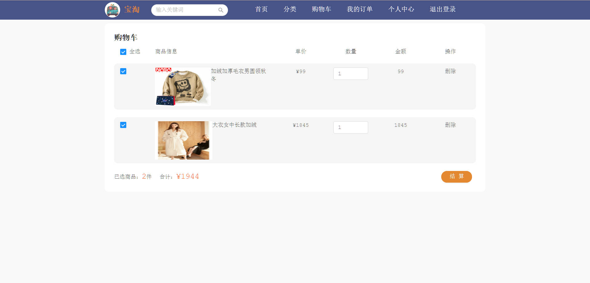
##### 商品详情
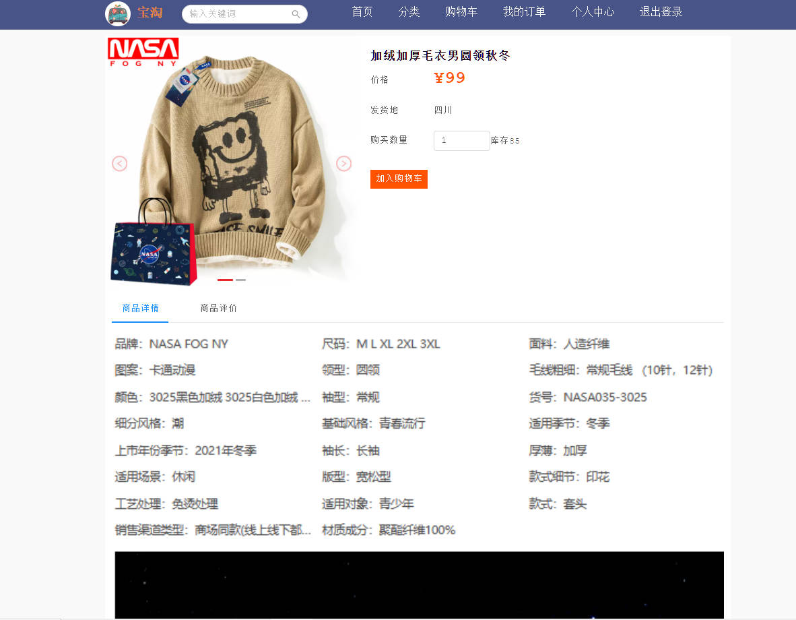
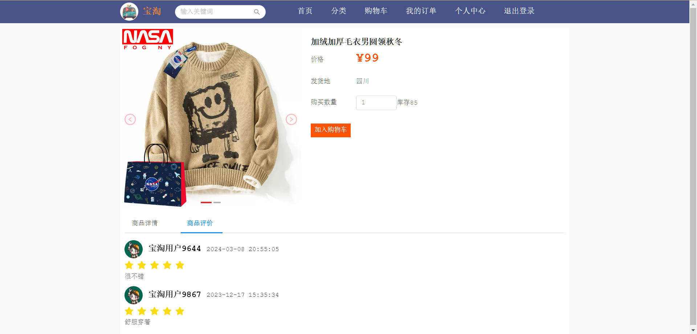
##### 确认订单
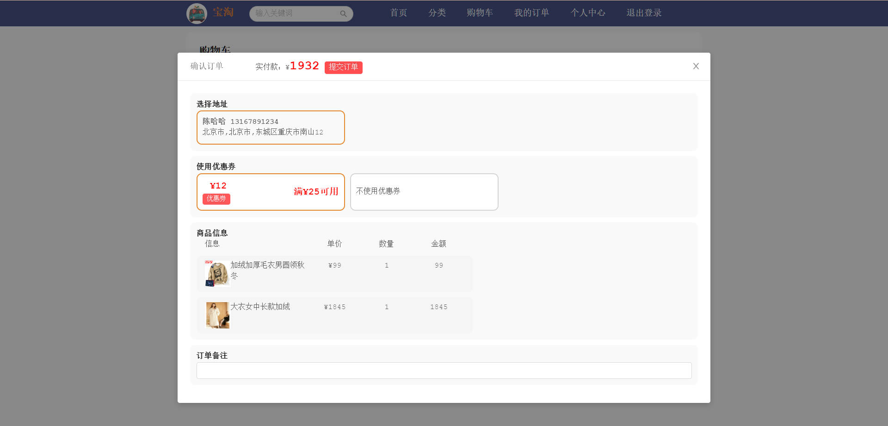
##### 我的订单
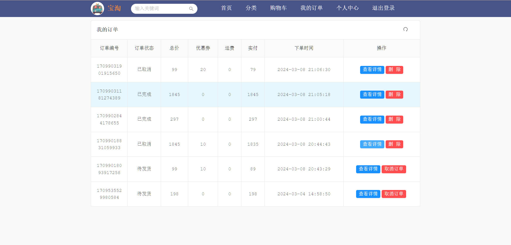
##### 个人信息
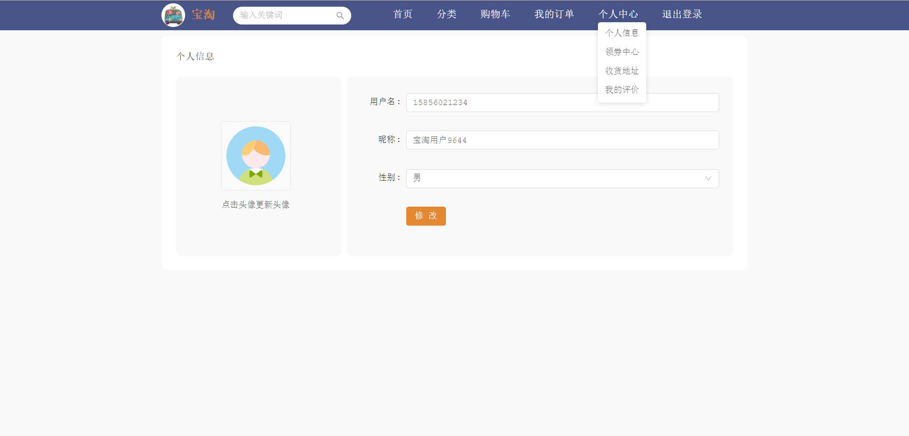
##### 领券中心
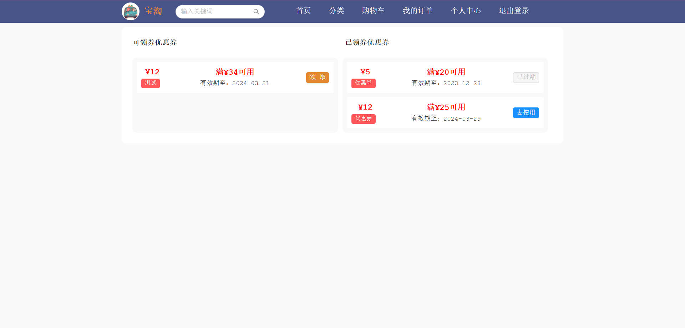
##### 收货地址
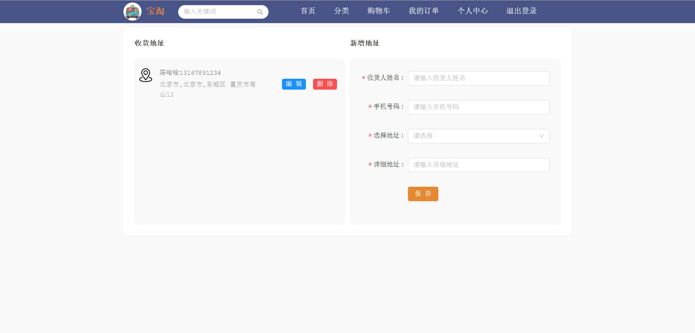
##### 我的评价
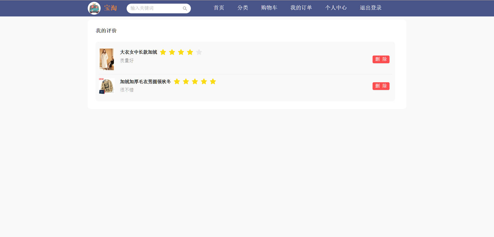
### 2.管理端

##### 后台功能

## 四、有疑问可戳我
1.  有需要或者疑问可+微信号：rolling_257
2.  请备注 购物网站源码获取
3.  提示该项目需要付费获取，编码不易
